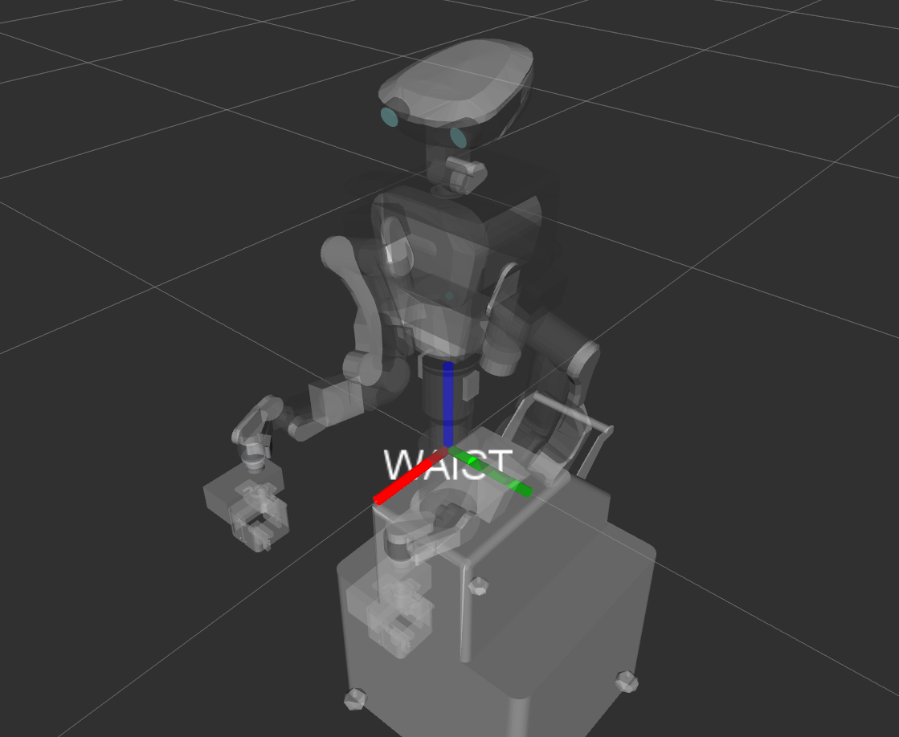
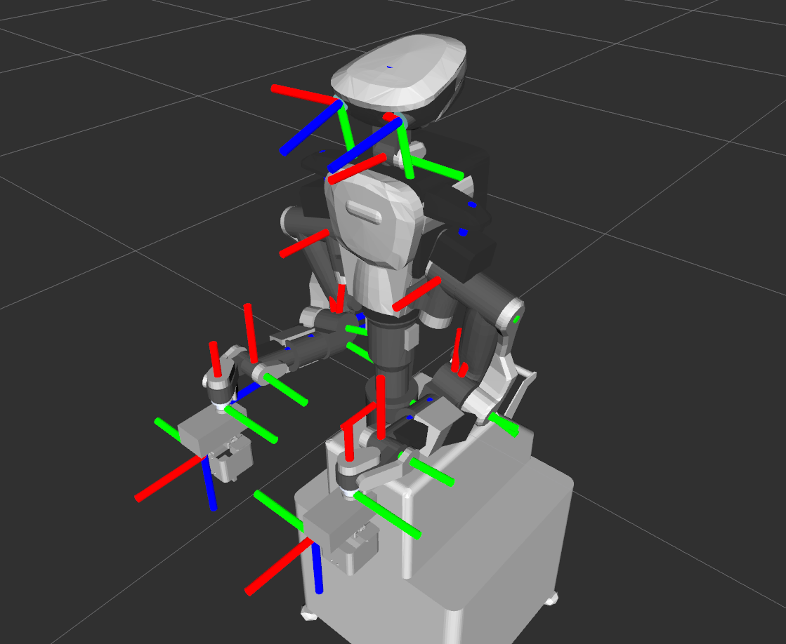

# ロボットハードウェアの概要

## ロボット諸元

詳しくはカワダロボティクスのサイト内にある NEXTAGE 製品仕様を参照してください．

- Kawada Robotics NEXTAGE - 製品仕様
  - メーカサイト
    - [http://nextage.kawada.jp/](http://nextage.kawada.jp/)
  - 自由度: 15軸
    - 腕6軸 x 2 : 肩 Yaw-Pitch，肘 Pitch，手首 Pitch-Roll
    - 首2軸 : 首 Yaw-Pitch
    - 腰1軸 : 腰 Yaw
  - 各関節動作仕様
    - 角度: [http://nextage.kawada.jp/specification/#specDousaTable](http://nextage.kawada.jp/specification/#specDousaTable)
    - 速度: [http://nextage.kawada.jp/specification/#specHontaiTable](http://nextage.kawada.jp/specification/#specHontaiTable)
  - 最大可搬質量
    - 片腕 : 1.5 kg
    - 両腕 : 3.0 kg
  - カメラ
    - 頭部 x 2
    - ハンドカメラ（オプション）

## 座標系

HIRO / NEXTAGE OPEN の座標系は下の図のようになっています．

ベース座標は腰基部中心に設定されています．

- ベース座標
  - X軸: 正 - 前方 / 負 - 後方
  - Y軸: 正 - 左側 / 負 - 右側
  - Z軸: 正 - 上方 / 負 - 下方



各フレームの座標系は次のようになっています．

- 各座標軸と色表記
  - X軸: Red
  - Y軸: Green
  - Z軸: Blue




# コンピュータとソフトウェアの概要

### 制御用コンピュータ

カワダロボティクスの HIRO および NEXTAGE OPEN ロボットシステムには次の2つのコンピュータがあります．

- コントロールボックス（QNXコンピュータ）
  - ロボットを制御するコンピュータ
  - QNX: 実時間オペレーティングシステム
  - デフォルトではソフトウェアのインストール・改変は不可
  - 保守・アップデートは可能
- UIコントロールボックス（Ubuntuコンピュータ/ビジョンPC）
  - 作業を行うコンピュータ
  - Ubuntu
  - 高次レイヤソフトウェアの実行

### 開発用コンピュータ

HIRO および NEXTAGE OPEN のシステムでは2台の制御用コンピュータの他に
開発用コンピュータも使用することができます．

- 開発用コンピュータ要求仕様
  - Intel i5 以上のプロセッサ
  - 4GB 以上のメモリ
  - 15GB 以上のディスク空き容量
  - Ubuntu 14.04
  - ROS Indigo
  - QNXコンピュータにイーサネット経由で接続(ロボット所有者のみ)

## ソフトウェアの概要

下に HIRO / NEXTAGE OPEN の QNX と Ubuntu のソフトウェアコンポーネント構成図を示します．
ユーザーは ROS と RTM(hrpsys) のどちらを利用してもロボットを制御するソフトウェアをプログラムすることができます．


## API の概要

HIRO / NEXTAGE OPEN で使用する API をシステムの観点で大別すると RTM と ROS の2種があり，
ROS API でも ROS インタフェース と MoveIt! インタフェースに分けることができます．

- RTM API on hrpsys
- ROS API
  - ROS インタフェース
  - MoveIt! インタフェース

それぞれの API が Python や C++ などのプログラミング言語で利用することができます．

下図にそれら API の構成図を示します．


### 各 API の利用法

各 API の利用法や使い分けについては次を参考にしてください．

- RTM ベースのインタフェースの方が実装されている機能が多い
  - HIRONX ロボットが元々 OpenRTM 上で動作しており，それに対して RTM プロセスと ROS で書かれたプログラムを繋ぐ hrpsys_ros_bridge を作った経緯のため
- キャリブレーションやサーボの ON/OFF などの基本的な操作は RTM インタフェースを使用
- 全ての API は同一プログラム言語で書かれた1つのプログラムファイル内で混成利用可能


# 保守・管理

## Ubuntuソフトウェアのアップデート

Ubuntu 上の全てのソフトウェアをアップデートする場合は次のコマンドを実行してください．

```
$ sudo apt-get update && sudo apt-get dist-upgrade
```

HIRO / NEXTAGE OPEN のソフトウェアのみをアップデートする場合は次のコマンドを実行してください．

```
$ sudo apt-get update && sudo apt-get ros-indigo-rtmros-nextage ros-indigo-rtmros-hironx
```

## QNX での作業

### QNX GUIツール - NextageOpenSupervisor

QNX に関する日常的な作業のうち次のものは
カワダロボティクスから提供されている GUI ツール NextageOpenSupervisor を用いて操作することができます．

- コントロールボックス（QNXコンピュータ）のシャットダウン処理
- アップデート

このツールは UIコンピュータ（Ubuntuコンピュータ/ビジョンPC）に
nxouser アカウントでログオンするとデスクトップ上にアイコンがあります．

### QNXのコマンド操作

本作業は QNX にログオンできることを前提としたものです．
次のコマンドで QNX にSSH接続とログオンを行います．

```
YOURHOST$ ssh -l %QNX_YOUR_USER% %IPADDR_YOUR_QNX%
```

##### QNX シャットダウンコマンド

```
QNX$ su -c '/opt/grx/bin/shutdown.sh'
```

##### QNX リブートコマンド

```
QNX$ su -c '/bin/shutdown'
```

### ログファイルの定期メンテナンス

### QNXのログファイル

QNX のログファイルは `/opt/jsk/var/log` にあります．

- Nameserver.log
- Modelloader.log
- rtcd.log

これらのログファイルは自動的に生成されますが，自動的には削除されません．

### ログファイルの圧縮・削除

ディスクスペースにおいてログファイルはすぐに何ギガバイトにもなってしまします．
これらのログファイルは自動的に削除される仕組みにはなっておりませんので，
時おり `/opt/jsk/var/log` 下のログファイルを削除することをお勧めします．

ログファイルの削除はスクリプトの実行もしくはリモートログインによる手動操作で行うことができます．

##### スクリプト操作によるログファイルの圧縮

```
# Remove all raw .log files to free disk space. Same .zip file will be kept in the log folder.

$ rosrun hironx_ros_bridge qnx_fetch_log.sh nextage qnx_nxo_user archive
```

##### 手動でのログファイルの削除

QNX コンピュータログオンできる場合においては SSH 接続をして，
ディレクトリ `/opt/jsk/var/log` 下にあるログファイルを削除することができます．

##### ディスク空き容量の確認

QNX コンピュータログオンできる場合においては SSH 接続をして，
ディスクの空き容量を確認することができます．

```
QNX$ df -h
```

ディスク空き容量の例
```
/dev/hd0t179 7.8G 7.1G 725M 92% /
/dev/hd0t178 229G 22G 207G 10% /opt/
/dev/hd0 466G 466G 0 100%
```


### QNXでのインストールやソフトウェア利用

HIRO / NEXTAGE OPEN ソフトウェアはすべて公開されていますが，
それは HIRO / NEXTAGE OPEN でダウンロードしてただ実行するだけで済むということを意味していません．
それらのソフトウェアは QNX オペレーティングシステム上で動いているコントローラボックスで
ビルド・コンパイルする必要があります．
QNX 上ででコンパイルするには，地域のベンダーから購入できる開発者ライセンスが必要です．

QNX に必要なソフトウェアをインストールする方法も開示されていません．
QNX は開発者ライセンス以外にも，その運用者は運用認定が必要もしくは十分に運用に精通している必要がある商用ソフトウェアです．
また，QNX では頑強なパッケージングインフラストラクチャ（ROSのようなもの）がないため，
インストール作業は非常に長い手作業となる可能性があり，エラーが発生しやすくなります．

しかし，次のような場合には QNX 内での作業が必要となります．

- 以前のクローズドソースの GRX コントローラに戻す必要があるとき
- デバッグ時に Ubuntu ソフトウェアの API で見られるログだけでは原因が不明な場合に QNX 上のログファイルを見るとき

このような場合には製造元またはソフトウェアサービスプロバイダからログオンアカウント情報を入手することができます．


<!-- EOF -->
