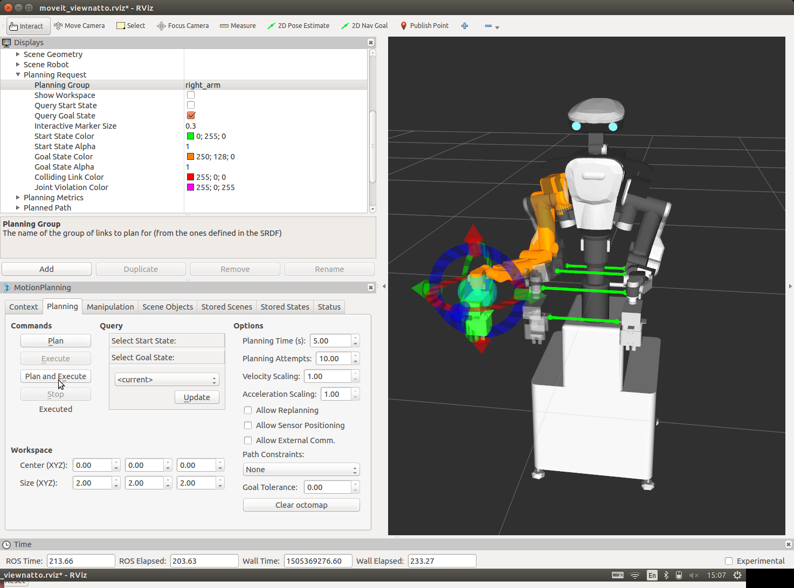
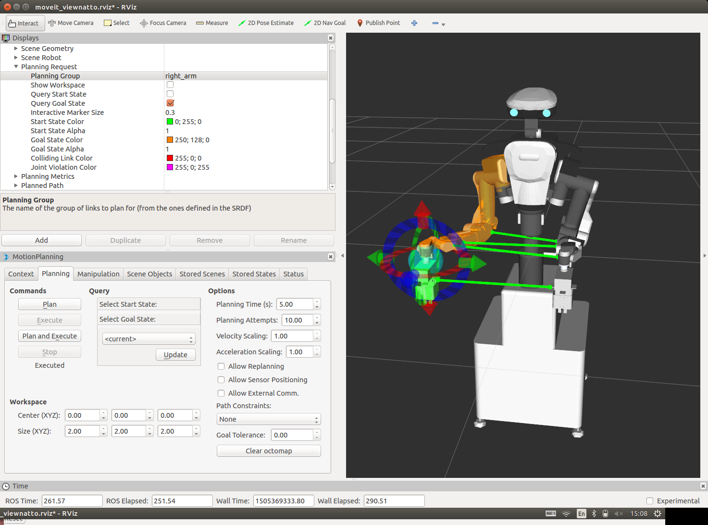
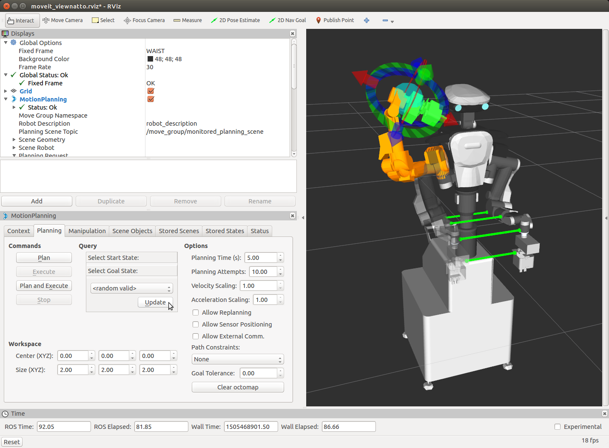

# はじめに

## 安全について

NEXTAGE OPEN ロボットを動作させる前に必ず次の事項を確認してください．

- ロボットが適切に設置されている
- 周辺に動作に必要な空間が確保されている
- 緊急停止スイッチがいつでも押せる状態になっている


## クイックスタート

### コンピュータの起動

1. 台座の下部にキャスターを上下に動かすノブがあります．
このノブを反時計回りに回してロボットを床に固定します.

2. AC電源プラグは台座から出ています．電源につないでください．

3. キーボードとマウス，ディスプレイモニタをUIコントロールボックスに接続してください．
UIコントロールボックスは2つあるコンピュータのうち上側のコンピュータです．


4. AC電源を入れてください．コントローラボックスのメインスイッチが赤く点灯します．


5. スイッチボックスをロボットの後ろ側にあるコネクタに接続してください．


6. ロボットの後ろ側にある緑色のボタンを押してください．ビープ音が1分ほど鳴ります．
ロボット胸部にある4つのLEDライトが全て点滅します．


7. ロボットの後ろ側にある青色のボタンを押してください．
ロボットの胸部にある緑色と白色のLEDライトのみが点滅していたら，
ロボットの動作準備が整った状態となっています．


### ソフトウェアのアップデート

出荷状態のロボットにおいては Ubuntu 側のソフトウェアに最新のバージョンがインストールされていない場合があります．

UIコントロールボックスのターミナルを開いて次の1行のコマンドを実行するとアップデートされます．
本コマンド実行の際には別途通知されているルートパスワードが必要です．

```
$ sudo apt-get update && sudo apt-get dist-upgrade
```

### ROS サーバの起動

#### rtm_ros_bridge の実行

UIコントロールボックスのターミナルで下記のコマンドを実行して ROS ソフトウェアを実行します．

```
$ roslaunch hironx_ros_bridge hironx_ros_bridge_real.launch    (HIRO)

$ roslaunch nextage_ros_bridge nextage_ros_bridge_real.launch    (NEXTAGE OPEN)
```

デフォルト状態の NEXTAGE OPEN ではホスト名 `nextage` でアクセスすることができ，
それは `nextage_ros_bridge_real.launch` 内に既に記述されています．

ホスト名を変更した場合には下記コマンドの`%HOSTNAME%` の部分を変更したホスト名に置き換え，明示的にコマンドを実行してください．

```
$ roslaunch hironx_ros_bridge hironx_ros_bridge_real.launch nameserver:=%HOSTNAME%   (HIRO)

$ roslaunch nextage_ros_bridge nextage_ros_bridge_real.launch nameserver:=%HOSTNAME%   (NEXTAGE OPEN)
```

このプログラムはプログラムからロボットを操作するときには実行された状態である必要があります．

#### ROS プロセスの確認

rtm_ros_bridge を実行しているターミナルとは別のターミナルを開いてください．
新しいターミナルで次のコマンドを実行することで動作しているROSノードを確認することができます．

```
$ rosnode list
/diagnostic_aggregator
/hrpsys_profile
/hrpsys_ros_diagnostics
/hrpsys_state_publisher
/rosout
```

### Hironx Dashboard によるロボットの初期化

#### rqt での Hironx Dashboard の起動

Hironx Dashboard は rqt 上で動きますのでターミナルから rqt を起動します．

```
$ rqt
```

rqt の Plugins で Hironx Dashboard を選択します．


#### ロボットのキャリブレーション

Hironx Dashboard からロボットの関節角度のエンコーダのキャリブレーションを行います．

- 注意-1: スイッチボックスの緊急停止スイッチをいつでも押せる状態にしてください．
- 注意-2: ロボットが動きます．

Hironx Dashboard の [ Joint Calibration ] ボタンを押してください．

次のようにロボットが動きます．

FROM:<br>


TO:<br>


#### ロボットを初期姿勢にする

ロボットの各関節を初期姿勢にします．

- 注意: ロボットの全関節が動きます．（初期姿勢から外れいてる場合）

Hironx Dahsboard の [ Goto init pose ] ボタンを押してください．


### MoveIt! での動作の実行

ROS の GUI も備えたモーションプランニングフレームワークの MoveIt! を用いてロボットを動かしてみます．

#### MoveIt! の起動

MoveIt! を起動します．新しくターミナルを開いて次のコマンドを実行してください．

```
$ roslaunch hironx_moveit_config moveit_planning_execution.launch   (HIRO)

$ roslaunch nextage_moveit_config moveit_planning_execution.launch  (NEXTAGE OPEN)
```


#### MoveIt! での動作計画と実行

MoveIt! 内に表示されているロボットモデルの手先に矢印や球で表現されているマーカがあります．
これは InteractiveMarker と呼ばれるもので，これで手先の位置と姿勢を指定します．

手先姿勢を変更する前に次の準備を実行してください．

1. Planning タブ Querry の Select Start State: < current > で [ Update ] ボタンをクリック
2. Planning タブ Querry の Select Goal State: < current > で [ Update ] ボタンをクリック

InteractiveMarker をマウスでドラッグして少し移動させてみます．
色違いの腕が表示されていることと思います．
現在のロボットの姿勢と InteractiveMarker で指定した目標姿勢が表示されています．



Planning タブ内の [ Plan ] ボタンをクリックしてください．
MoveIt! 内においてアニメーションで腕が目標姿勢になるように動作計画が表示されていることと思います．

アニメーション表示された動作計画で実機ロボット周囲の状況も含めて干渉など問題がないようでしたら，
実際にロボットを目標姿勢になるように動かしてみます．

- 注意: ロボットが動きます．

Planning タブ内の [ Plan and Execute ] ボタンをクリックしてください．



MoveIt! で動作計画したように実際にロボットが動いたことと思います．

他の目標姿勢にも動かしてみます．
ここでは MoveIt! にランダムな姿勢を生成させます．

- 注意: 生成された目標姿勢に対するロボット周辺の状況を確認しながら下記の手順を進めてください．


1. Planning タブ Querry の Select Start State: で < random valid > を選択
2. Select Start State: [ Update ] ボタンをクリック（再クリックで再生成）
3. Commands の [ Plan ] ボタンをクリック → 動作計画の確認
4. ロボット動作環境などの安全確認
5. Commands の [ Plan and Execute ] ボタンをクリック → 動作の実行



> MoveIt! での動作計画と実行の手順まとめ
>
> 1. Planning タブ Querry の Select Start State: < current > で [ Update ] ボタンをクリック
> 2. Planning タブ Querry の Select Goal State: < current > で [ Update ] ボタンをクリック
> 3. MoveIt! 上の InteractiveMarker でロボットの手をドラックして目標姿勢に移動
> 4. Planning タブ Commands の [ Plan ] ボタンをクリックして動作計画を確認
> 5. ロボットの動作による周辺環境との干渉などの問題がないことを確認
> 6. Planning タブ Commands の [ Plan and Execute ] ボタンをクリック


### ロボットのシャットダウン処理

#### ロボットをサーボオフ姿勢にする

ロボットの各関節をサーボオフ姿勢にしてサーボ切ります．

- 注意: ロボットが動きます．

Hironx Dahsboard の [ Goto init pose ] ボタンを押してください．

これによりロボットの各関節がサーボオフ姿勢になり，サーボが切れます．

#### 全プログラムの終了

実行しているプログラムを全て終了します．
全てのターミナルで `Ctrl-c` により終了してください．

#### QNX の停止

Ubuntu デスクトップ上にある NextageOpenSupervisor ツールを用いて QNX コンピュータのシャットダウンを行ってください．

#### Ubuntu の終了

コマンド `$ sudo shutdown now` などで Ubuntu を終了します．

- 注意: 不在時もコンピュータをオンにしておく場合は製造元の指示に従ってください．


## 動力学シミュレーション

### RTM の動力学シミュレーション - hrpsys-simulator

ロボットの核となる機能は OpenRTM というフレームワーク上で動いています．
この OpenRTM をベースとした hrpsys-simulator と呼ばれるシミュレータでロボットの機能を仮想的に実現することができます．
このシミュレータは ROS が提供する高層レイヤを使用しなくても利用できます．

特別な目的ではないプログラムを実行する多くの場合においてこのシミュレータで十分です．

#### シミュレータの実行

実際のロボットを「模倣する」シミュレータを起動します．
`roslaunch` ではなく `rtmlaunch` であることに注意して次のコマンドを実行してください．

```
$ rtmlaunch hironx_ros_bridge hironx_ros_bridge_simulation.launch   (HIRO)

$ rtmlaunch nextage_ros_bridge nextage_ros_bridge_simulation.launch (NEXTAGE OPEN)
```

> この launch ファイルは主に次の2つを実行します．
>
> まずはシミュレータに仮想ロボットを読み込みます．
>
> ```
> $ rtmlaunch hironx_ros_bridge hironx_startup.launch
> ```
>
> このシミュレーションのロボットは OpenRTM ベースのソフトウェア上のみで実行されています．
>
> 次に ROS 経由でこのロボットを動作させるために ROS と OpenRTM の2つの空間を結ぶ「橋」をつくります．
>
> ```
> $ roslaunch hironx_ros_bridge hironx_ros_bridge.launch    (HIRO)
>
> $ roslaunch nextage_ros_bridge nextage_ros_bridge.launch    (NEXTAGE OPEN)
> ```

次のようなコマンドプロンプトが表示されていたら，シミュレーションが正常に動作しています．

```
[ INFO] [1375160303.399785831, 483.554999999]: [HrpsysSeqStateROSBridge0] @onExecutece 0 is working at 201[Hz]
[ INFO] [1375160304.408500642, 484.544999999]: [HrpsysSeqStateROSBridge0] @onExecutece 0 is working at 198[Hz]
```

そして hrpsys simulator viewer が次のように表示されます．


#### MoveIt! の起動とシミュレーションロボットの操作

ロボット実機と同じように MoveIt! を起動してシミュレーション上のロボットを操作することができます．

```
$ roslaunch hironx_moveit_config moveit_planning_execution.launch   (HIRO)

$ roslaunch nextage_moveit_config moveit_planning_execution.launch  (NEXTAGE OPEN)
```

MoveIt! 内での操作も実機のロボットとシミュレーション上のロボットでは同じです．
InteractiveMarker を動かし，動作計画をし，実行します．


### ROS の動力学シミュレーション - Gazebo

NEXTAGE OPEN の Gazebo シミュレーションを起動します．

- メモ: ROS / Gazebo でのシミュレーションのため rtm_ros_bridge は不要

```
$ roslaunch nextage_gazebo nextage_world.launch
```

Gazebo nextage_world に
セスナ機，カフェのテーブル，建設用のバレル，HUSKYロボットオブジェクトをインサートした図


<!-- EOF -->
