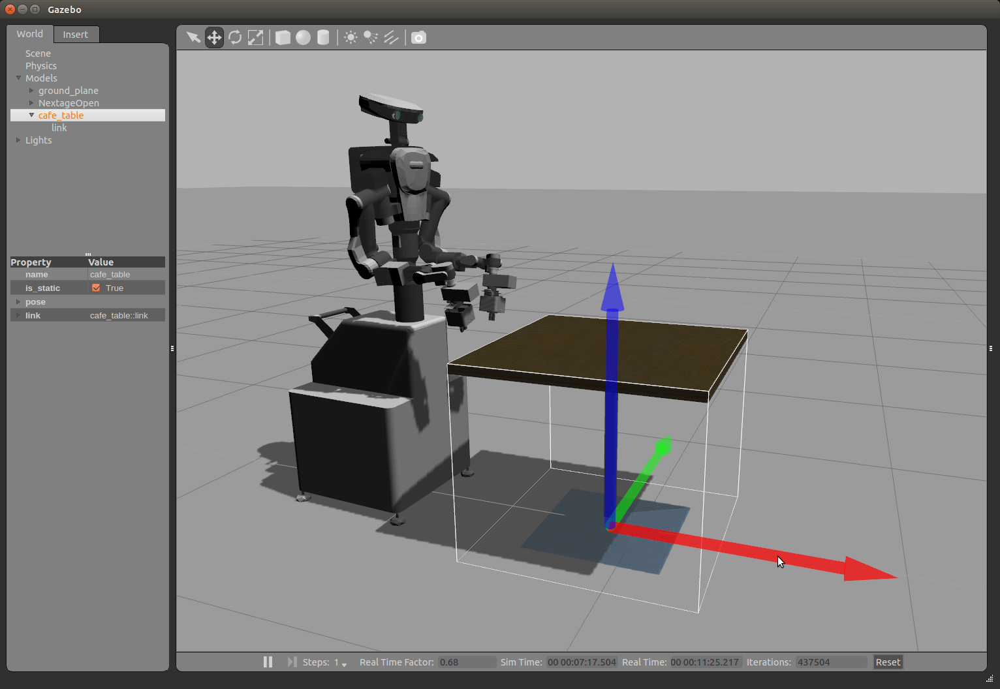
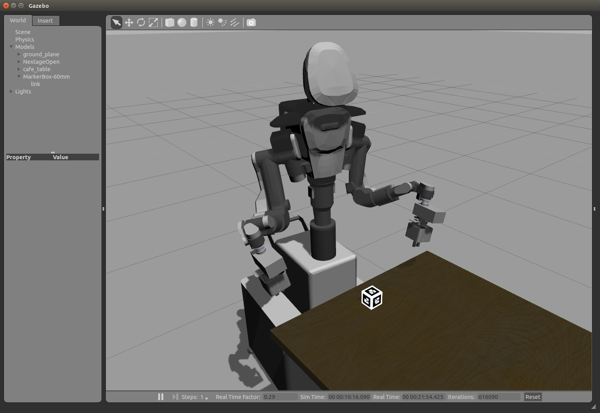
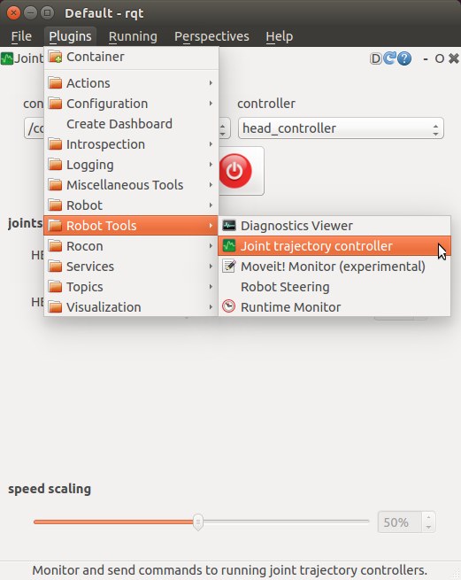
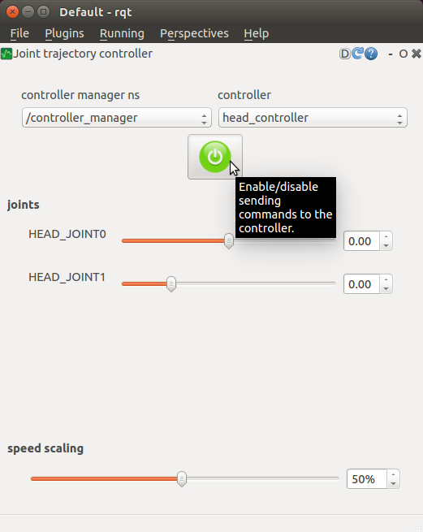
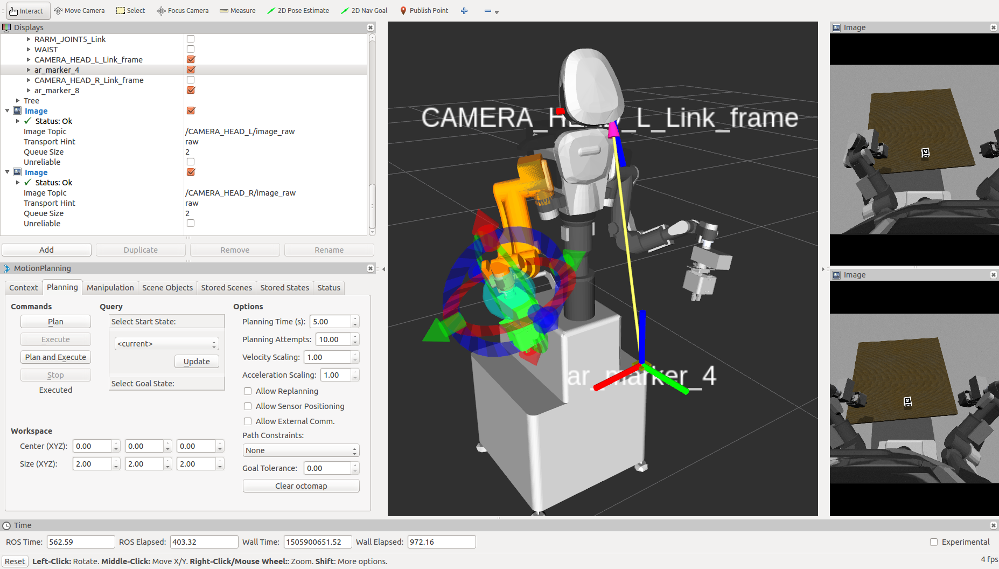
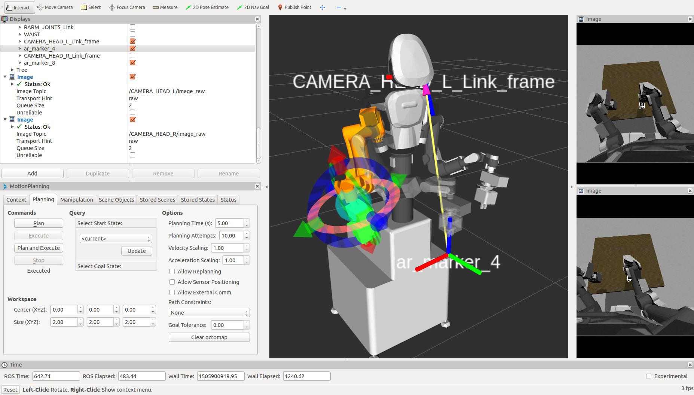
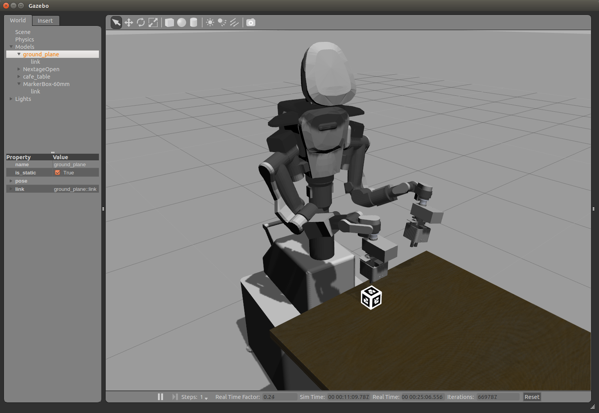

# チュートリアル: 3次元認識

## ロボット搭載カメラの設定

### NEXTAGE OPEN のカメラ

NEXTAGE OPEN（HIRO ではない）はデフォルトで頭部に2つ，左右ハンドに1つずつで
合計4つの IDS Ueye カメラが搭載されています．
それらのカメラの操作は ueye_cam パッケージにて行われ，基本的にそれは

- nextage_ros_bridge/launch/nextage_ueye_stereo.launch
- nextage_ros_bridge/launch/hands_ueye.launch

内にてまとめられています．

- 注意: HIRO のカメラについて
  - 本項で記述されている内容は HIRO に搭載されているカメラに関するものではありません．
  - HIRO のカメラを動作させる方法は本項で説明されている内容と異なる可能性があります．

### ユーザ独自のカメラの利用について

デフォルトで搭載されている以外のカメラも
ROS のドライバがあるものについては使用することができます．
既に ROS のドライバが存在しているカメラの情報は次のリンク先で知ることができます．

- Sensors/Cameras - ROS Wiki
  - [http://wiki.ros.org/Sensors/Cameras](http://wiki.ros.org/Sensors/Cameras)
  - 注意: 手作業で更新されているので全ての情報を網羅するものではありません．

ユーザによっては Kinect や Xtion カメラをロボット頭部に搭載して利用したりしています．
そのような場合には tf の確認や MoveIt! で衝突判定を行うのであれば
カメラの 3D モデルなどを構築してロボットモデルを更新する必要があります．

### ヘッドカメラの設定

#### Ueye カメラノードの実行

まずロボット頭部のカメラが頭部に設置されていることを確認してください．
ステレオカメラのノードを実行します．

```
$ roslaunch nextage_ros_bridge nextage_ueye_stereo.launch
```

このノードでは ueye_cam パッケージを利用していますので
次のように映像トピックをサブスクライブ（購読）することができます．

```
$ rostopic echo left/image_raw
$ rostopic echo right/image_raw
```

映像は rqt_image_view などの GUI ツールを使用して見ることができます．

#### ステレオカメラのキャリブレーション

ステレオカメラを利用する前にはキャリブレーション作業が必要です．

- How to Calibrate a Stereo Camera - ROS Wiki
  - [http://wiki.ros.org/camera_calibration/Tutorials/StereoCalibration](http://wiki.ros.org/camera_calibration/Tutorials/StereoCalibration)

次のコマンドでステレオカメラのキャリブレーションを行います．

```
$ rosrun camera_calibration cameracalibrator.py --size 4x6 --square 0.024 --approximate=0.1 --camera_name=stereo_frame right:=/right/image_raw left:=/left/image_raw right_camera:=/right left_camera:=/left
```

キャリブレーション結果のデータは <your home directory>/.ros/camera_info 内に保存してください．
このデータは消さないようにしてださい．

### ハンドカメラの設定

次のコマンドにより左右ハンドに搭載されている合計2つのカメラを動作させます．

```
$ roslaunch nextage_ros_bridge hands_ueye.launch
```

ハンドカメラの映像は次のトピックにより購読できます．

```
$ rostopic echo /left_hand_ueye/image_raw   (left)
$ rostopic echo /right_hand_ueye/image_raw  (right)
```


## AR マーカを使ったオブジェクト認識と動作計画

AR マーカをロボットのカメラ画像から認識します．

### AR マーカ認識プログラムの実行

新しいターミナルで AR マーカの認識プログラムを起動します．
ar.launch では NEXTAGE OPEN ロボットの右手 Ueye カメラの画像から AR マーカの検出をします．

```
$ roslaunch nextage_ros_bridge ar.launch marker_size:=4.5
```

> ar.launch 内で認識させる AR マーカの大きさなどが書かれています．
>
> ```xml
> <launch>
>     <arg name="marker_size" default="5.5" />
>     <arg name="max_new_marker_error" default="0.08" />
>     <arg name="max_track_error" default="0.2" />
>     <arg name="cam_ns" default="right_hand_ueye" />
>     <arg name="cam_image_topic" default="/$(arg cam_ns)/image_raw" />
>     <arg name="cam_info_topic" default="/$(arg cam_ns)/camera_info" />
>     <arg name="output_frame" default="/camera" />
>
>     <node name="ar_track_alvar" pkg="ar_track_alvar" type="individualMarkersNoKinect"
>           respawn="false" output="screen"
>           args="$(arg marker_size) $(arg max_new_marker_error) $(arg max_track_error) $(arg cam_image_topic) $(arg cam_info_topic) $(arg output_frame)" />
> </launch>
> ```
>
> AR マーカのサイズは次に示すところに単位センチメートルで記述されています．
>
> ```
>     <arg name="marker_size" default="5.5" />
> ```
>
> デフォルトの 5.5 [cm] 以外のサイズの AR マーカを認識させる場合には
> 次のように ar.launch 実行時に引数でサイズを指定して実行します．
>
> ```
> $ roslaunch nextage_ros_bridge ar.launch marker_size:=4.5
> ```
>
> - メモ: AR マーカのサイズ = マーカの黒い部分全体の辺の長さ


### MoveIt! と AR マーカの表示

MoveIt! を起動してください．

```
$ roslaunch nextage_moveit_config moveit_planning_execution.launch
```

MoveIt! でロボットのカメラ映像を表示させます．

1. [ Add ] ボタンをクリック
2. “rviz” → “Image” をクリックして選択 → “Image” の子ウィンドウが表示
3. Displays → Image → Image Topic の項目で /right_hand_ueye/image_raw を選択

AR マーカが印刷された紙などを右手のカメラに映るように設置してください．
必要であればロボットの腕も動かしてください．
ここでは AR 番号が ar_marker_4 でサイズが 4.5 cm としています．

次にマーカの処理結果を表示させます．

1. [ Add ] ボタンをクリック
2. ”rviz” → ”Marker” をクリック
3. [ Add ] ボタンをクリック
4. ”rviz” → ”TF” をクリック
5. Displays → TF → Frames → All Enabled のチェックを外す
6. Displays → TF → Frames → /ar_marker_4 のチェックを入れる

AR マーカの各番号に対応した色の四角い立体とその tf が MoveIt! / RViz 上で表示されます．

MoveIt! / RViz の設定を保存しておくと上記の追加作業が不要になるので便利です．
MoveIt! / RViz の File メニューから Save Config As を選択して，
例えばファイル名 moveit-ar.rviz などの名前で設定を保存します．

MoveIt! / RViz で保存してある設定を利用するには File メニューの Open Config から設定ファイルを読み込みます．


### AR マーカ認識に基づく動作計画と実行

デモンストレーションプログラム ar_demo.py は AR マーカを認識して得られた座標を基に
MoveIt Commander を利用して動作計画・指示・実行などを行います．

ar_demo.py のコードは次のようになっています．

```python
#!/usr/bin/env python  

import rospy
import tf
import geometry_msgs.msg
import sys

from moveit_commander import MoveGroupCommander
from tf.transformations import *
import math

def kbhit():
    import select
    return sys.stdin in select.select([sys.stdin], [], [], 0)[0]

if __name__ == '__main__':
    rospy.init_node('ar_pose_commander', anonymous=True)
    group = MoveGroupCommander("right_arm")

    base_frame_id = '/WAIST'
    ar_marker_id = '/ar_marker_4'

    pub = rospy.Publisher('target_pose', geometry_msgs.msg.PoseStamped)
    listener = tf.TransformListener()

    rate = rospy.Rate(10.0)
    pose_st_target = None
    while not rospy.is_shutdown() and not kbhit():
        try:
            now = rospy.Time(0)
            (trans,quat) = listener.lookupTransform(base_frame_id, ar_marker_id, now)
            quat = quaternion_multiply(quat, quaternion_about_axis(math.pi/2, (1,0,0)))
            quat = quaternion_multiply(quat, quaternion_about_axis(math.pi/2, (0,0,1)))
            pose_st_target = geometry_msgs.msg.PoseStamped()
            pose_st_target.pose.position.x = trans[0]
            pose_st_target.pose.position.y = trans[1]
            pose_st_target.pose.position.z = trans[2]
            pose_st_target.pose.orientation.x = quat[0]
            pose_st_target.pose.orientation.y = quat[1]
            pose_st_target.pose.orientation.z = quat[2]
            pose_st_target.pose.orientation.w = quat[3]
            pose_st_target.header.frame_id = base_frame_id
            pose_st_target.header.stamp = now
        except (tf.LookupException, tf.ConnectivityException, tf.ExtrapolationException) as e:
            rospy.logwarn(e)

        if pose_st_target:
            pub.publish(pose_st_target)
            rospy.loginfo(trans)

        rate.sleep()

    if raw_input() == 'q':
        sys.exit(1)

    # move to a point above ar marker
    pose_st_target.pose.position.z += 0.3
    rospy.loginfo("set target to {}".format(pose_st_target.pose))
    group.set_pose_target(pose_st_target.pose)
    plan = group.plan()
    rospy.loginfo("plan is {}".format(plan))
    ret = group.go()
    rospy.loginfo("executed ... {}".format(ret))

```

デモンストレーションコードの中から主要な行について解説します．

右手を動かします．そのために `"right_arm"` を引数として渡して
`MoveGroupCommander` をインスタンス化します．

```python
    group = MoveGroupCommander("right_arm")
```

基準となるフレームを `/WAIST` に
ターゲットとする AR マーカのフレームを `/ar_maker_4` として変数に格納します．
AR マーカのターゲットを変えたい場合はここを変更すれば良いことになります．

```python
    base_frame_id = '/WAIST'
    ar_marker_id = '/ar_marker_4'
```

サンプリング周波数 10 Hz を `rate = rospy.Rate(10.0)` で指定して
基準フレームとターゲットの AR マーカのフレーム間の TF を取得します．
ターゲット取得ループは Enter キーが押されると抜けるようにしています．

```python
    listener = tf.TransformListener()

    rate = rospy.Rate(10.0)
    pose_st_target = None
    while not rospy.is_shutdown() and not kbhit():
        try:
            now = rospy.Time(0)
            (trans,quat) = listener.lookupTransform(base_frame_id, ar_marker_id, now)
```

TF で取得された AR マーカフレームの姿勢から右腕エンドエフェクタの目標姿勢になるように
クォータニオンの計算をします．

```python
        quat = quaternion_multiply(quat, quaternion_about_axis(math.pi/2, (1,0,0)))
        quat = quaternion_multiply(quat, quaternion_about_axis(math.pi/2, (0,0,1)))
```

TF で取得した AR マーカフレームの位置と計算されたターゲットの姿勢を
`pose_st_target` に格納します．

```python
        pose_st_target = geometry_msgs.msg.PoseStamped()
        pose_st_target.pose.position.x = trans[0]
        pose_st_target.pose.position.y = trans[1]
        pose_st_target.pose.position.z = trans[2]
        pose_st_target.pose.orientation.x = quat[0]
        pose_st_target.pose.orientation.y = quat[1]
        pose_st_target.pose.orientation.z = quat[2]
        pose_st_target.pose.orientation.w = quat[3]
```

Enter キーが押されるとターゲット取得ループから抜けて
右腕のエンドエフェクタを AR マーカ `/ar_marker_4` の真上に右手を動かします．

まず，エンドエフェクタをターゲットの 0.3 [m] 上方に動くように位置のZ座標を再計算してから，
右腕の Group に対して目標姿勢として設定します．

```python
    pose_st_target.pose.position.z += 0.3
    group.set_pose_target(pose_st_target.pose)
```

次に右腕の動作計画を行い，その結果のログを表示します．

```python
    plan = group.plan()
    rospy.loginfo("plan is {}".format(plan))
```

そして動作計画を実行して，その結果のログを表示します．

```python
    ret = group.go()
    rospy.loginfo("executed ... {}".format(ret))
```

それでは実際に ar_demo.py を実行してみます．

```python
$ rosrun nextage_ros_bridge ar_demo.py
```

コンソールに黄色い文字でワーニングが表示されている場合は座標の変換が完遂できていない場合です．
白い文字で座標変換ができている旨のメッセージが出ているときに Enter キーを押すことにより
AR 認識で得られた座標データから右手の目標姿勢を定めて動作計画を行い AR マーカの上まで移動させます．


### Gazebo での AR マーカ認識シミュレーション

Gazebo を用いて仮想空間内の AR マーカを認識するシミュレーションを行います．
ここでは頭部カメラの画像を AR マーカ認識に使用します．

#### Gazebo の起動とモデルの読み込み

NEXTAGE OPEN の Gazebo シミュレーションを起動します．

- メモ: ROS / Gazebo でのシミュレーションのため rtm_ros_bridge は不要

```
$ roslaunch nextage_gazebo nextage_world.launch
```

Gazebo の仮想空間内に次の2つのモデルを読み込みます．

 - Cafe table
 - MarkerBox-60mm

"cafe_table" モデルを Gazebo のライブラリから読み込みます．

1. 左コラムの Insert タブを選択
2. “http://gazeboism.org/models/” を選択して “Cafe table” をクリック
3. ポインタに Cafe table がついてくるのでロボットの前の床でクリックして設置
4. 上の方にある十字の矢印アイコンボタンをクリック後 Cafe table をクリック
5. 赤緑青の座標軸をドラッグして Cafe table の位置を調整


- メモ: Gazebo 起動直後は "http://gazeboism.org/models" が表示されずに<br>
  "Connecting to model database..." になっているかもしれません．<br>
  しばらくするとデータベースにつながってモデルが読めるようになります．



"MarkerBox-60mm" モデルは Gazebo のライブラリに登録されていないので
ユーザコンピュータの `~/.gazebo/model/` ディレクトリにモデルフォルダをコピーします．
ターミナルなどを使用してコピーしてください．

```
$ cp -r MarkerBox-60mm/ ~/.gazebo/model/
```

- AR マーカモデルフォルダ
  - /opt/ros/indigo/nextage_gazebo/models/MarkerBox-60mm
  - もしくは Catkin ワークスペース内 CATKIN_WORKSPACE/src/rtmros_nextage/nextage_gazebo/models/MarkerBox-60mm
  - ソースURL:  [https://github.com/tork-a/rtmros_nextage/blob/indigo-devel/nextage_gazebo/models/MarkerBox-60mm](https://github.com/tork-a/rtmros_nextage/blob/indigo-devel/nextage_gazebo/models/MarkerBox-60mm)

コピーしたモデル MarkerBox-60mm を Gazebo に読み込みます．

1. 左コラムの Insert タブを選択
2. “/home/USERNAME/.gazebo/models” を選択して “MarkerBox-60mm” をクリック
3. ポインタを動かしてモデルを Cafe table の下の床の上でクリックして設置
4. 上の方にある十字の矢印アイコンボタンをクリックモデルをクリック
5. 赤緑青の座標軸をドラッグして Cafe table 上で，
ロボット頭部カメラを下に向けたときに写りそうな位置に調整



カメラの画角に AR マーカが入るように頭部姿勢を動かします．
ここでは rqt の Joint Trajectory Controller プラグインを利用します．

```
$ rqt
```

Plugins の Robot Tools 内 Joint trajectory controller を選択します．



Joint trajectory controller 内で下記のように設定します．

- controller manager ns : /controller_manager
- controller : head_controller

Enable/disable ボタンをクリックして緑色になると頭部の各関節を動かせる状態になります．
joints 下の各スライダを動かして頭部の姿勢を調整してください．




#### AR プロセスと MoveIt! の起動

新しいターミナルで AR マーカの認識プログラムを起動します．

```
$ roslaunch nextage_ros_bridge ar_headcamera.launch sim:=true
```

ar_headcamera.launch
```xml
<launch>

    <arg name="marker_size" default="4.5" />
    <arg name="max_new_marker_error" default="0.08" />
    <arg name="max_track_error" default="0.2" />
    <arg name="cam_ns" default="CAMERA_HEAD_L" />
    <arg name="cam_image_topic" default="/$(arg cam_ns)/image_raw" />
    <arg name="cam_info_topic" default="/$(arg cam_ns)/camera_info" />
    <arg name="output_frame" default="/CAMERA_HEAD_L_Link" />
    <arg name="sim" default="false" />

    <node name="ar_track_alvar" pkg="ar_track_alvar" type="individualMarkersNoKinect"
          respawn="false" output="screen"
          args="$(arg marker_size) $(arg max_new_marker_error) $(arg max_track_error) $(arg cam_image_topic) $(arg cam_info_topic) $(arg output_frame)" />

    <group if="$(arg sim)">
        <node pkg="tf" type="static_transform_publisher" name="camera_head_l_link_to_frame"
              args="0 0 0 1.57080 3.14159 1.57080 /CAMERA_HEAD_L_Link /CAMERA_HEAD_L_Link_frame 100" />
        <node pkg="tf" type="static_transform_publisher" name="camera_head_r_link_to_frame"
              args="0 0 0 1.57080 3.14159 1.57080 /CAMERA_HEAD_R_Link /CAMERA_HEAD_R_Link_frame 100" />
    </group>

</launch>
```

あとはロボット実機で行った場合と同様に MoveIt! と ar_demo.py を実行します．

1. MoveIt! を起動 + （オプション）RViz 設定ファイルの読み込み
2. ar_demo.py の実行

を行います．

MoveIt! - ar_demo.py 実行前



MoveIt! - ar_demo.py 実行後



Gazebo - ar_demo.py 実行後




<!-- EOF -->
