# チュートリアル: MoveIt! GUI

## MoveIt! - ROS の動作計画ソフトウェア

ROS の動作計画アプリケーションの代表的なソフトウェアパッケージが MoveIt! です．
HIRO / NEXTAGE OPEN においても rtm_ros_bridge がありますので
MoveIt! の動作計画機能を利用することができます．


## MoveIt! GUI の操作

基本的な操作は "クイックスタート" の "MoveIt! での動作の実行" を参照してください．

#### 左腕・両腕の動作計画への切り替え

HIRO / NEXTAGE OPEN において MoveIt! を起動したときは
デフォルトで右手の InteractiveMarker が操作できる状態になっています．
これを左手を操作して左腕の動作計画を作成するには，次の手順にて MoveIt! の設定を変更します．

1. 子ウィンドウ Displays 内の MotionPlanning → Plannning Request → Planning Group で left_arm を選択
2. 右手と同様に InteractiveMarker を操作して [ Plan and Execute ]

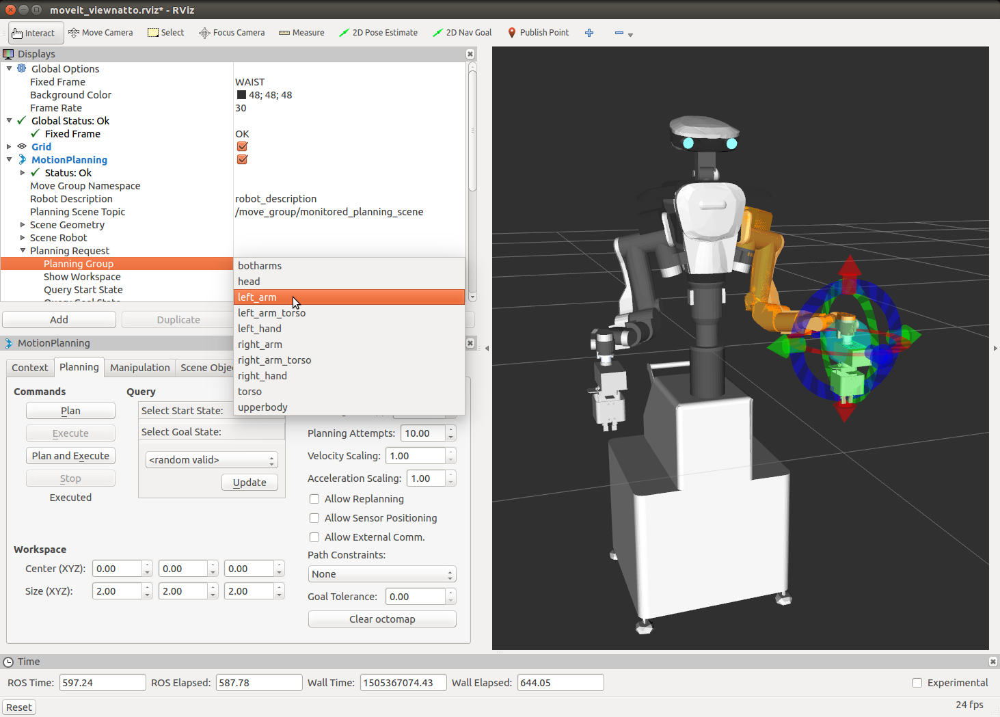

HIRO / NEXTAGE OPEN の MoveIt! では両腕での動作計画もできます．<br>
MoveIt! の GUI: RViz 上では 次のように選択します．

1. Displays 内の MotionPlanning → Plannning Request → Planning Group で botharms を選択
2. 各腕の InteractiveMarker を操作して [ Plan and Execute ]


#### 動作計画のループアニメーションと軌跡の表示

MoveIt! にて動作計画が作成されたときにはその動作アニメーションが1度表示されます．
動作計画をより確認しやすくするためにその動作アニメーションの繰り返し表示や
その軌跡表示を行うことができます．

次の手順で MoveIt! の設定を変更します．

1. 子ウィンドウ Displays 内の MotionPlanning → Planning Path → Loop Animation のチェックボックスを ON
2. Loop Animation のすぐ下にある Show Trail のチェックボックスを ON

MoveIt! でのアニメーションと軌跡の表示の様子（画像はアニメーションの途中をキャプチャ）

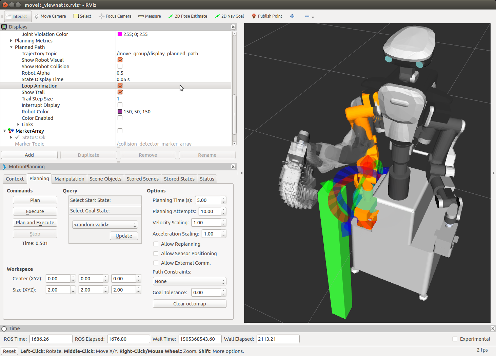

#### 動作計画上の各経過姿勢の確認

ループアニメーションでは確認しづらい動作計画上の任意の経過点の姿勢を確認するには
MotionPlanning - Slider を使います．

1. MoveIt! のメニュー Panels 内の MotionPlanning - Slider を選択
2. 動作計画を作成した後にスライダを操作して経過点の姿勢を表示

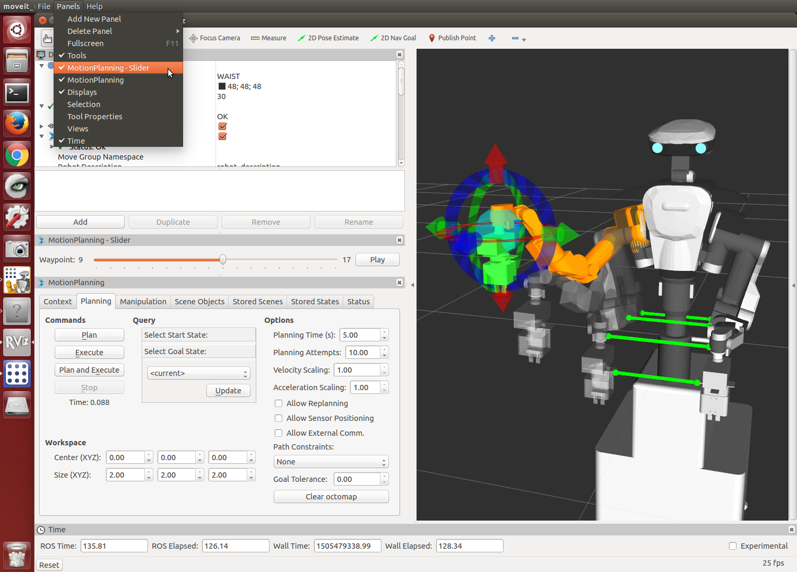

#### 実行動作の速度・加速度の調整

MotionPlanning 内 Planning タブにある Options の

- Velocity Scalling: 1.00
- Acceleration Scalling: 1.00

の値を 0〜1 の間で変更して動作の実行速度と加速度をそれぞれ動的に変更することができます．

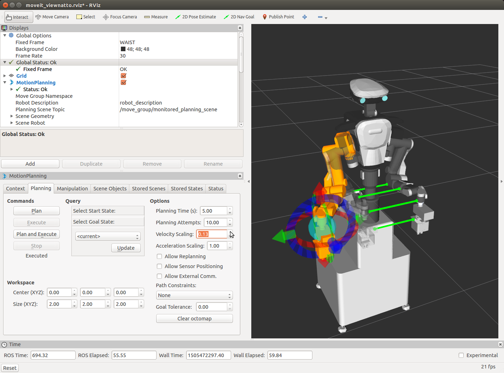

#### 逆運動学解のない姿勢での最善解の利用

デフォルトの設定では逆運動学解のない姿勢まで InteractiveMarker を動かすと
エンドエフェクタ（手先など）は解の存在するところで止まってしまいます．

MotionPlanning 子ウィンドウの Context タブ内の Kinematics 下
Allow Approximate IK Solutions のチェックを入れると，
厳密に逆運動学解がない姿勢でもそれに近い最善の解が利用されます．

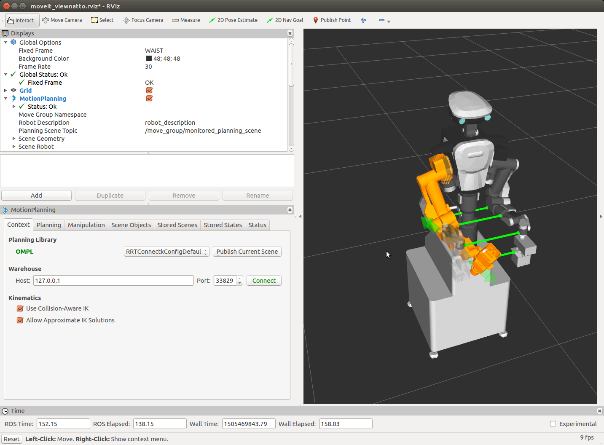

#### ジョイスティクの利用

HIRO / NEXTAGE OPEN にてジョイスティックを利用するためには
moveit_ros_visualization パッケージがインストールされてる必要があります．

moveit_ros_visualization パッケージがインストールされていない場合には
下記手順によりインストールしてください．
```
$ sudo apt-get install ros-indigo-moveit-ros-visualization
OR
$ sudo apt-get install ros-indigo-moveit    # This is simpler and better
```

ジョイスティックのプロセスを起動するには次のコマンドを実行してください．

```
$ roslaunch hironx_moveit_config joystick_control.launch
OR
$ roslaunch nextage_moveit_config joystick_control.launch
```

#### NEXTAGE OPEN での IKFast の利用

NEXTAGE_OPEN では IKFast パッケージを利用することができます．
MoveIt! を実行するときに引数として運動学の設定を IKFast を利用するように指定します．

```
$ roslaunch nextage_moveit_config moveit_planning_execution.launch kinematics_conf:=`rospack find nextage_moveit_config`/config/kinematics_ikfast.yaml
```

## MoveIt! GUI での障害物を回避する動作計画

MoveIt! の最大の特徴の1つは障害物を回避するような動作が自動生成されるところにあります．

### 障害物モデルデータを利用した MoveIt! の動作計画

環境が既知とした場合に
障害物の 3D モデルデータのファイルを MoveIt! に読み込んで動作計画を行う方法を紹介します．

#### 障害物モデルのシーンファイルの読み込み

MoveIt! 内に次の手順により障害物モデルファイルの読込みを行います．

1. MotionPlanning 内 Scene Objects タブで [ Import From Text ] ボタンをクリック
2. ファイル nxo_pillar.scene を選択して [ OK ] をクリック
3. 必要であれば障害物の InteractiveMarker を操作してロボットの手の近くに移動
4. Context タブで [ Publish Current Scene ] をクリック → 障害物がシーンに反映


- 障害物モデルファイル
  - /opt/ros/indigo/nextage_moveit_config/models/nxo_pillar.scene
  - もしくは Catkin ワークスペース内 CATKIN_WORKSPACE/src/rtmros_nextage/nextage_moveit_config/models/nxo_pillar.scene
  - ソースURL: [https://github.com/tork-a/rtmros_nextage/blob/indigo-devel/nextage_moveit_config/models/nxo_pillar.scene](https://github.com/tork-a/rtmros_nextage/blob/indigo-devel/nextage_moveit_config/models/nxo_pillar.scene)

Import From Text<br>

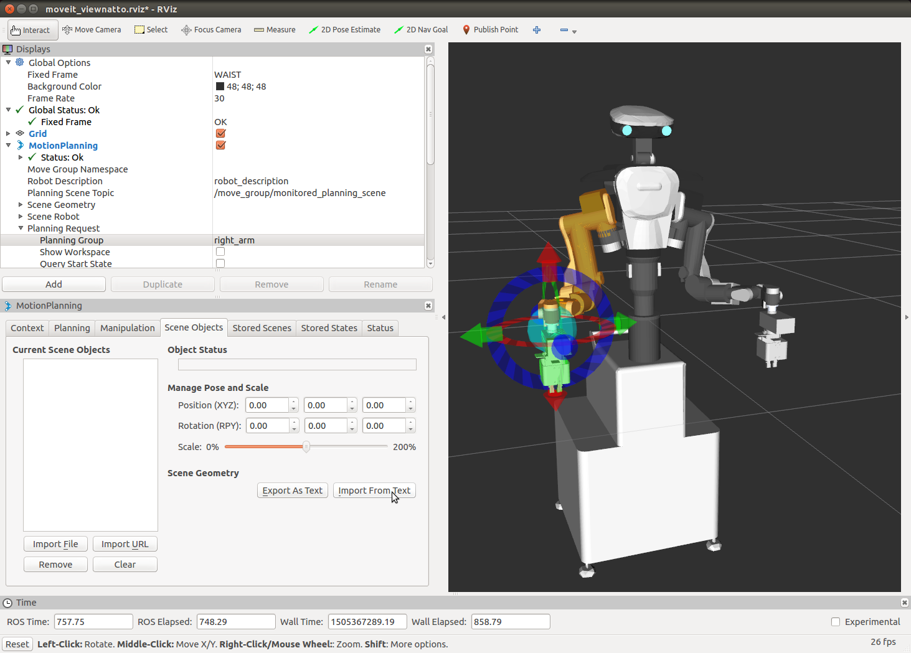

Publish Current Scene<br>

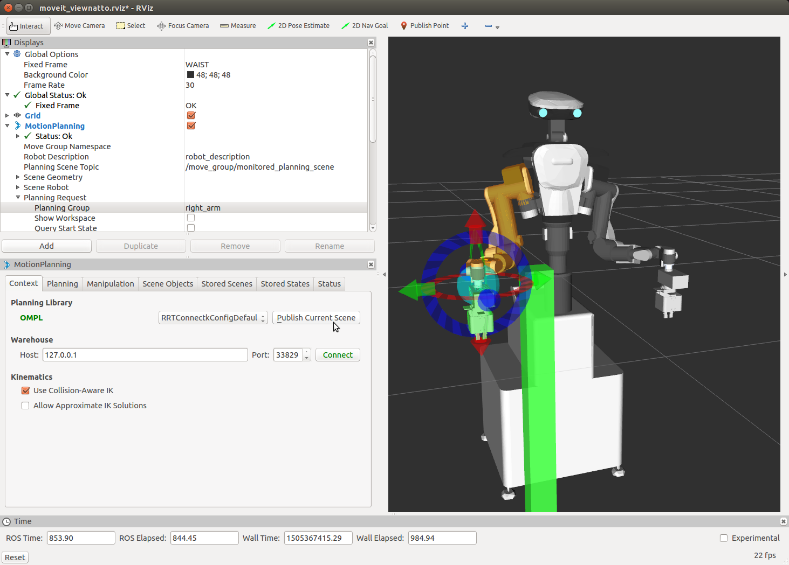

シーンファイル nxo_pillar.scene の内容

```
nxo_pillar
* nxo_pillar
1
box
0.1 0.1 1.1
0.4 -0.2 -0.42
0 0 0 1
0 0 0 0
.
```

#### 障害物を回避する動作計画とその実行

読み込んだ障害物モデルのある環境に応じた動作計画を行ってロボットを動かします．

障害物を回避する経路は自動的に生成されるので，動作計画を行う操作は障害物が無い場合と同じです．
次の操作で障害物を回避したモーションが自動生成されてロボットにその動作が出力されます．

- 注意: ロボットが動きます．


1. Planning タブ Querry の Select Start State: < current > で [ Update ] ボタンをクリック
2. Planning タブ Querry の Select Goal State: < current > で [ Update ] ボタンをクリック
3. MoveIt! 上の InteractiveMarker でロボットの手を現在の位置から障害物の反対側にドラッグ
4. Planning タブ Commands の [ Plan and Execute ] ボタンをクリック


障害物を回避する動作計画の例

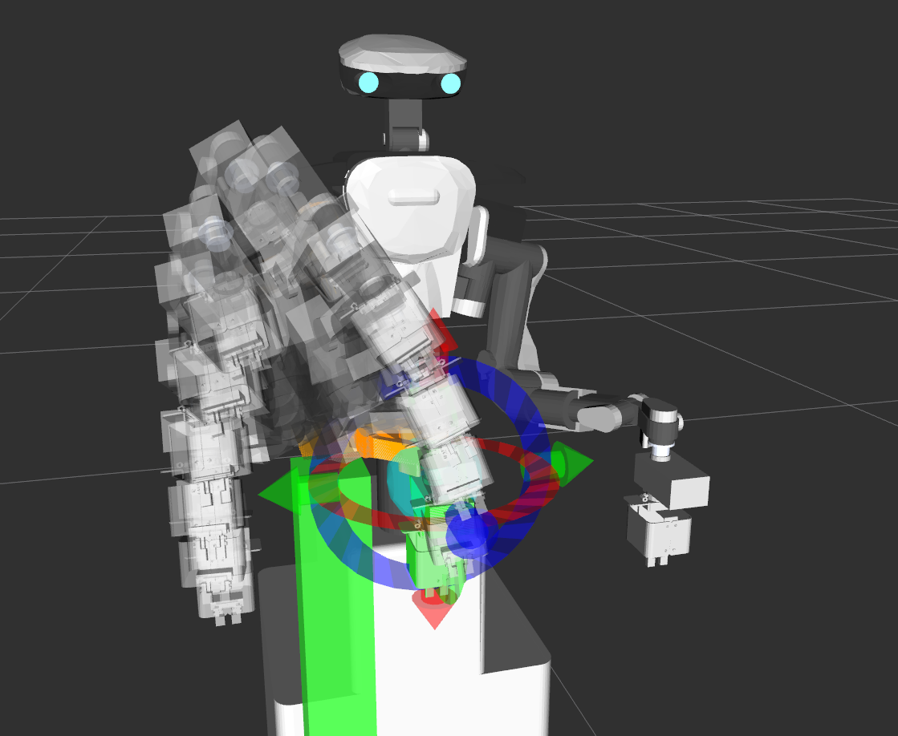

障害物が無い場合の動作計画の例

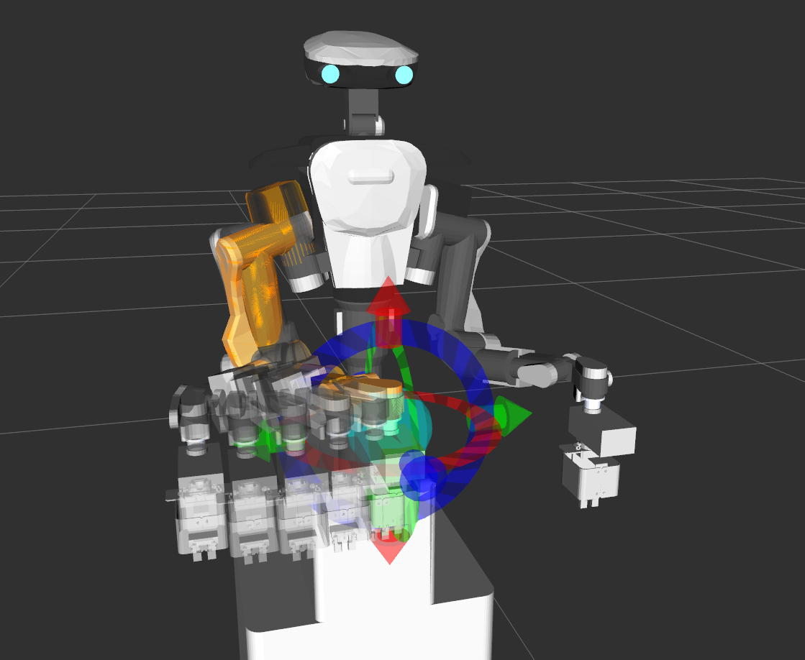


#### STL / COLLADA(DAE) モデルファイルの利用

MoveIt! には STL や COLLADA(DAE) モデルのファイルを直接読み込む機能もあります．<br>
MoveIt! 内に次の手順により障害物モデルファイルの読込みを行います．

1. MotionPlanning 内 Scene Objects タブで [ Import File ] ボタンをクリック
2. ファイル tsubo.dae もしくは tsubo.stl を選択して [ OK ] をクリック
3. 必要であれば障害物の InteractiveMarker を操作してロボットの手の近くに移動
4. Context タブで [ Publish Current Scene ] をクリック → 障害物がシーンに反映


- STL / COLLADA モデルファイル
  - /opt/ros/indigo/nextage_moveit_config/models/
  - もしくは Catkin ワークスペース内 CATKIN_WORKSPACE/src/rtmros_nextage/nextage_moveit_config/models/tsubo.*
  - ソースURL: [https://github.com/tork-a/rtmros_nextage/blob/indigo-devel/nextage_moveit_config/models/tubo.stl](https://github.com/tork-a/rtmros_nextage/blob/indigo-devel/nextage_moveit_config/models/tubo.stl) OR tsubo.dae

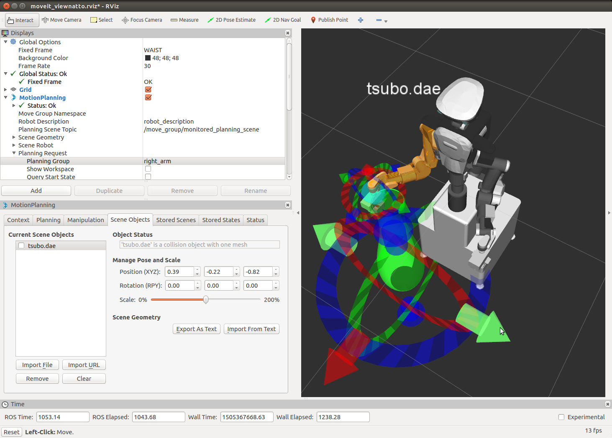

STL / COLLADA(DAE) モデルファイルを用いた場合も
シーンファイルを読み込んだ場合と同じ手順で
MoveIt! で障害物を回避する動作計画を作成できます．

Motion Planning - tsubo.dae

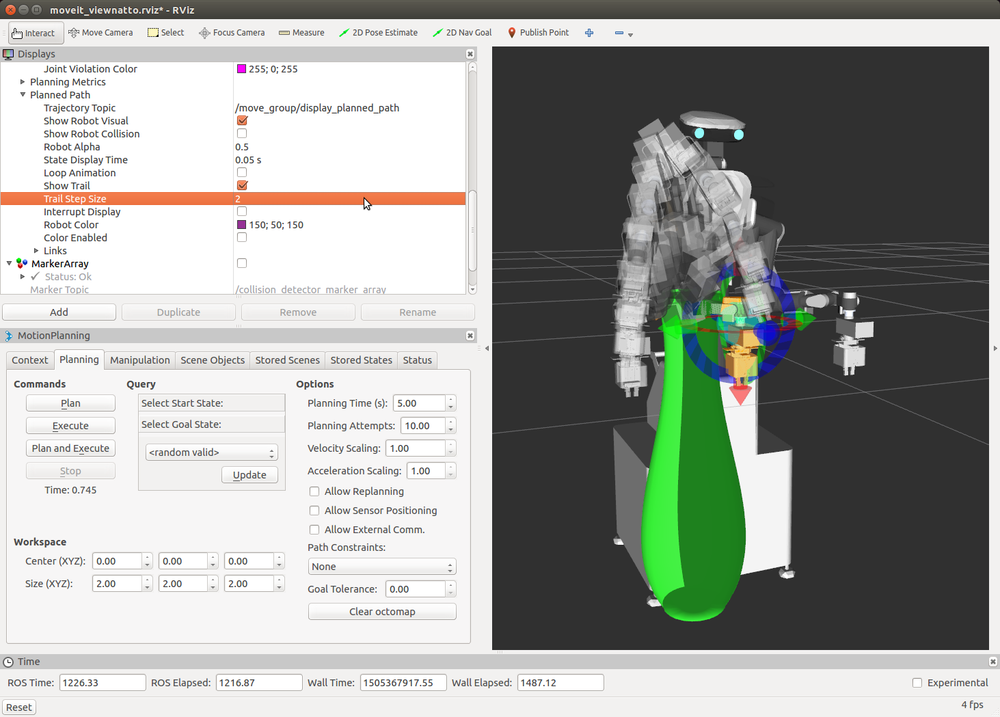


<!-- EOF -->
